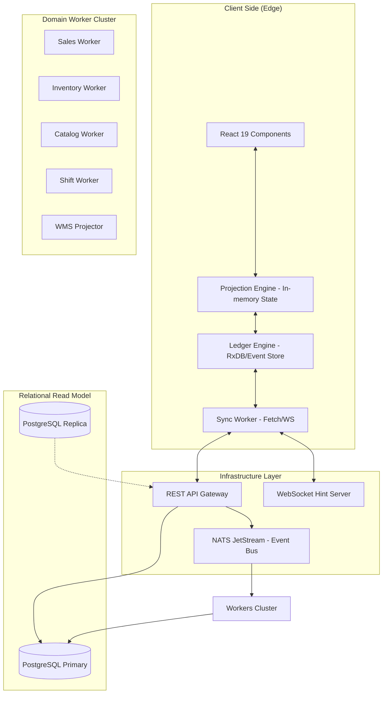
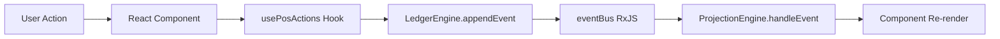
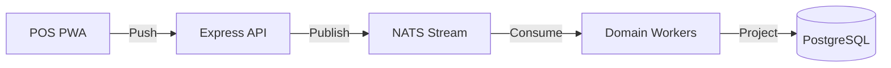
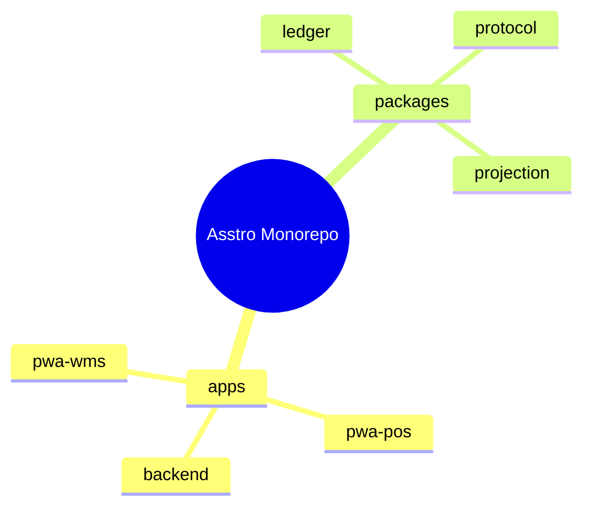
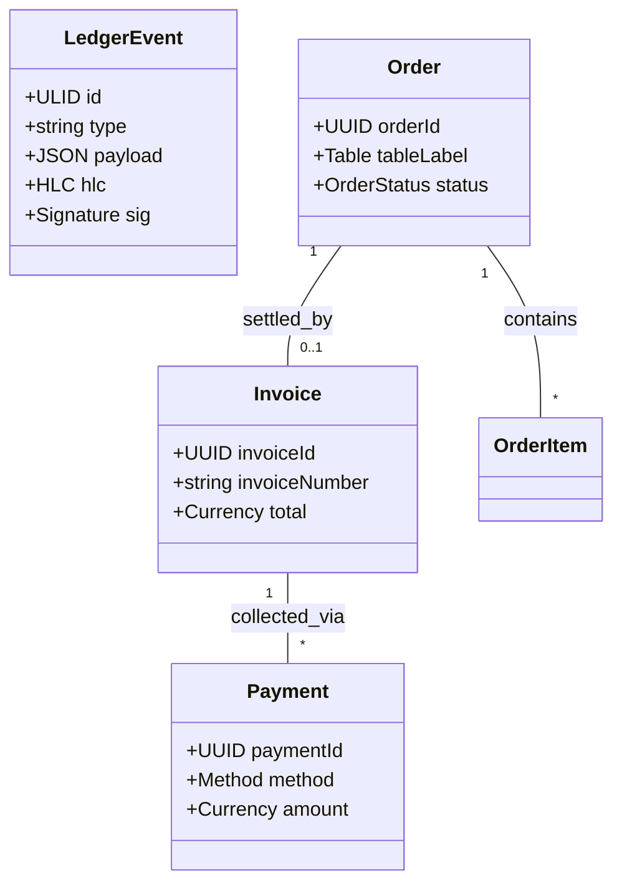
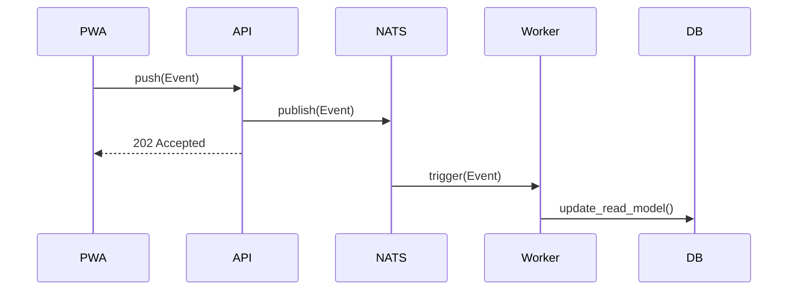
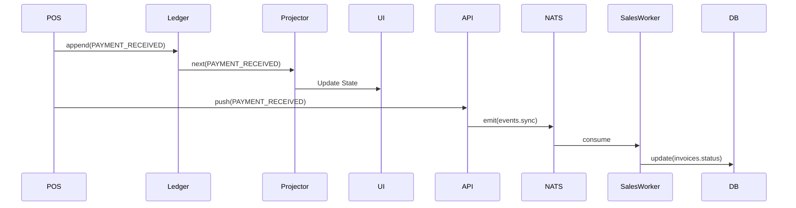
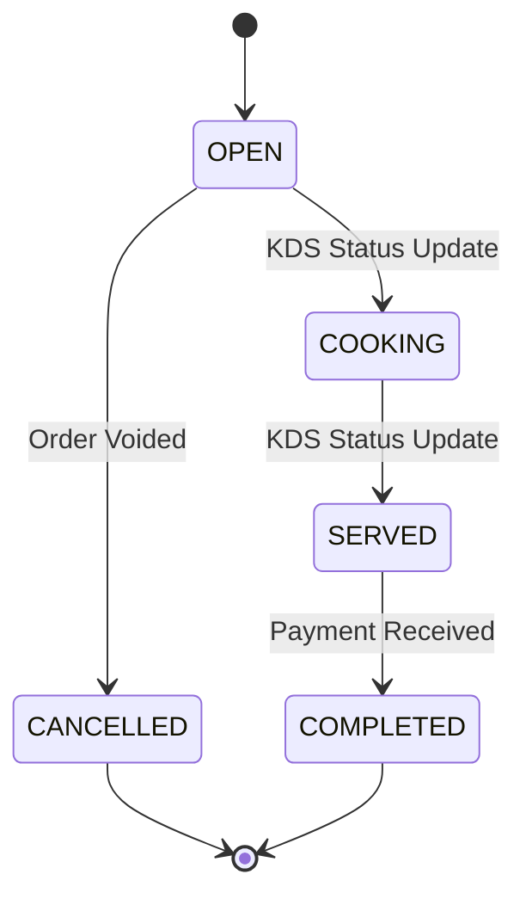
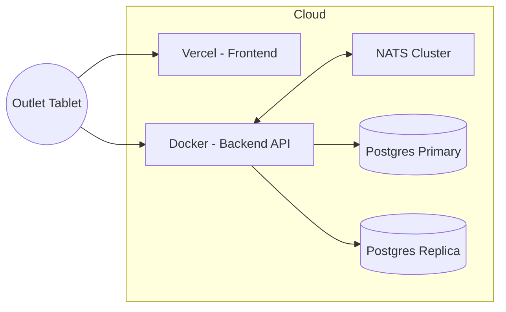
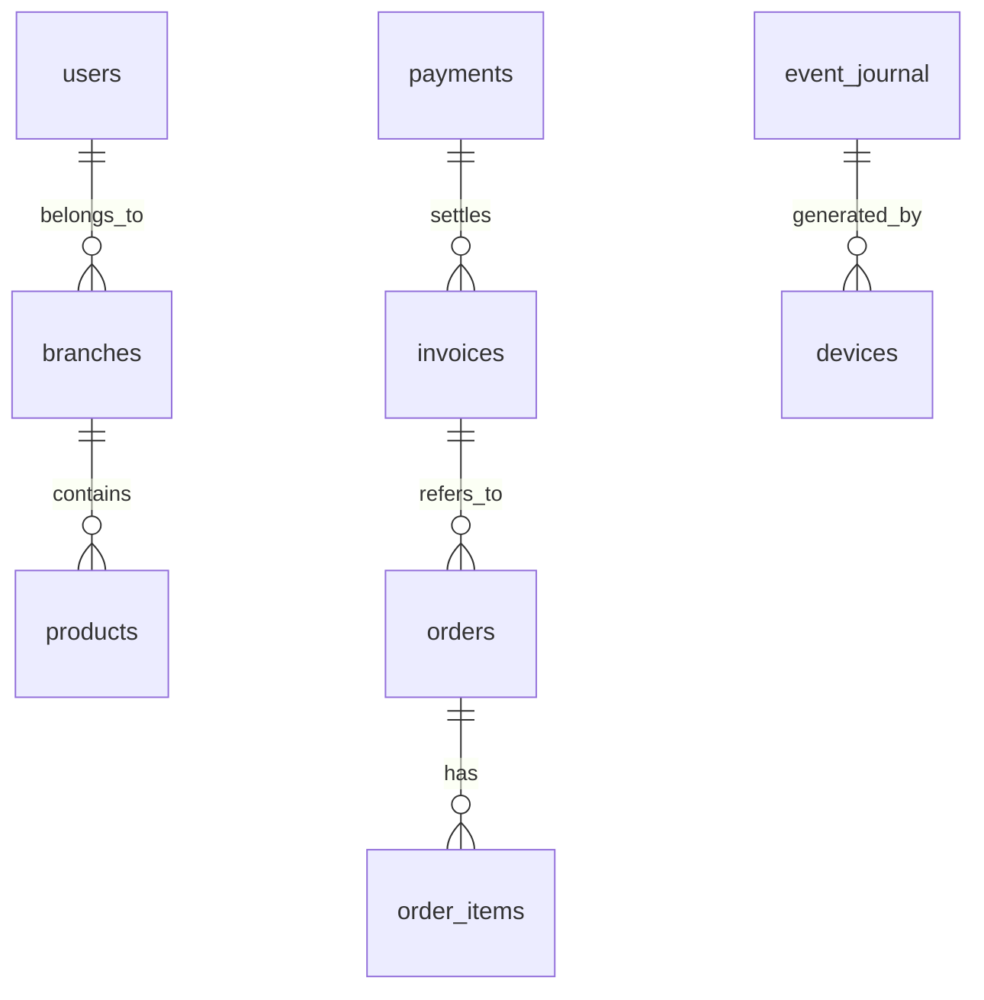

# ASSTRO ERP/POS - INDUSTRIAL-GRADE ARCHITECTURE BLUEPRINT

## 1 Executive Summary

### Project Overview
Asstro ERP/POS is a mission-critical, distributed enterprise solution designed for high-concurrency retail and Food & Beverage (FnB) environments. It employs a sophisticated **Event Sourced** and **Offline-First** architecture to ensure absolute data integrity and operational continuity even in unstable network conditions.

### Purpose
The system serves as a unified platform bridging the gap between front-of-house outlet operations (POS) and back-of-house regional logistics and financial oversight (WMS). It provides a cryptographically secure audit trail of every business fact.

### Technology Stack
| Layer | Technologies | Implementation Detail |
| :--- | :--- | :--- |
| **Frontend Core** | React 19, TypeScript | Reactive UI with functional components and hooks. |
| **Reactive Streams** | RxJS 7 | Event buses (`eventBus`, `errorBus`) for inter-module signaling. |
| **Local Persistence** | RxDB 17 | IndexedDB via Dexie storage; multi-instance disabled for POS stability. |
| **Backend Core** | Node.js, Express | Stateless REST API and durable worker processes. |
| **ORM / SQL** | Drizzle ORM | Type-safe schema definitions and Primary/Replica routing. |
| **Message Broker** | NATS JetStream | Persistent streams (`ASSTRO_EVENTS`) and durable consumers. |
| **Real-time Sync** | Socket.io 4.8 | Rooms-based broadcasting (`branch_{id}`) for sync hints. |
| **Security** | TweetNaCl, CryptoJS | Ed25519 signing for event non-repudiation. |

---

## 2 Business Analysis

### Business Domain
Enterprise Resource Planning (ERP) specializing in multi-outlet Retail and FnB operations.

### Actors & User Roles
| Role | Responsibility | Data Ownership |
| :--- | :--- | :--- |
| **Waiter** | Guest service, order entry, status tracking | Local Table/Order state |
| **Cashier** | Payment collection, shift closing, petty cash | Local Shift/Cash state |
| **Manager** | Operational oversight, staff management | Branch Master Data |
| **Superadmin** | Global configuration, regional provisioning | Global Master Data |

### Core Business Processes
- **Order-to-Cash:** Atomic progression from customer intent to financial settlement.
- **Inventory Saga:** Asynchronous stock deduction triggered by successful payment received events.
- **Regional Consolidation:** Merging local product definitions into a standardized global catalog.

### Business Rules (✓ Observed)
-   **Integrity:** Every event must be cryptographically signed by the device.
-   **Authorization:** Sensitive operations (Voids/Refunds) require Manager's PIN.
-   **Sequence:** Operations are strictly ordered via ULID and HLC to prevent causal paradoxes.

---

## 3 High Level Architecture

### Mermaid Diagram

---

## 4 Folder Architecture

### Complete Repository Structure
| Folder | Purpose | Responsibility | Ownership |
| :--- | :--- | :--- | :--- |
| `apps/backend` | Central Logic | API handling, NATS routing, Domain Projections. | Cloud Infra |
| `apps/pwa-pos` | Frontend POS | Offline-first UI for outlets. | Outlet Ops |
| `apps/pwa-wms` | Frontend WMS | Regional management dashboard. | Regional Mgmt |
| `packages/ledger` | Core Storage | Event Sourcing implementation, HLC, and Hashing. | Core Arch |
| `packages/projection` | State Logic | Translating event streams into observable UI state. | Core Arch |
| `packages/protocol` | Definitions | Shared Zod schemas, Types, and Event constants. | Core Arch |

---

## 5 Module Analysis

| Module | Purpose | Input | Output | Dependencies |
| :--- | :--- | :--- | :--- | :--- |
| **Ledger Engine** | Fact Persistence | Event Type/Payload | Signed LedgerEvent | RxDB, TweetNaCl |
| **Projection Engine** | State Computation | Event Stream | Observable State | RxJS, projection logic |
| **Sync Worker** | Distributed Sync | User Actions / Hints | REST Push/Pull calls | Socket.io-client |
| **Sales Worker** | Financial Projection | NATS Stream | SQL Records | Drizzle ORM |
| **Inventory Worker** | Stock Ledger | Saga Events | Stock Mutations | Drizzle ORM |

---

## 6 Domain Model

### Entities & Relationships (✓ Observed)
1. **LedgerEvent (Aggregate Root):** The system source of truth.
2. **Order:** Linked to a `tableLabel`. Lifecycle: `PENDING -> COOKING -> SERVED`.
3. **Invoice:** Financial demand. Status: `unpaid`, `partial`, `paid`, `void`, `refunded`.
4. **Payment:** Settlement record. Supports multiple methods per invoice.
5. **Shift:** Temporal boundary for cashier accountability.

---

## 7 Data Flow (✓ Observed)

### User Action to UI Update

---

## 8 Event Flow (✓ Observed)

### Command-Event-Projection Loop
-   **Command:** Frontend triggers business logic (e.g., `executeSale`).
-   **Event Creation:** `LedgerEngine` envelopes the fact with HLC and Signature.
-   **Propagation:** `SyncWorker` pushes to `/api/sync/push`.
-   **Distribution:** API publishes to NATS `events.sync`.
-   **Projection:** Backend Workers (e.g., `SalesWorker`) update PostgreSQL Read Models.

---

## 9 State Management (✓ Observed)

-   **Transient State:** Local React `useState` for component UI state.
-   **Global State:** `ProjectionEngine` maintaines in-memory caches for Tables, Products, and Transactions.
-   **Server State:** Mirrored relational data in PostgreSQL.
-   **Persistence:** Local RxDB (IndexedDB) for offline survivability.

---

## 10 UI Architecture

-   **Hooks Layer:** `usePosSync` (Read) and `usePosActions` (Write) decouple UI from logic.
-   **Provider Pattern:** `PosProvider` orchestrates the system state and makes it available globally.
-   **O(1) Performance:** UI reacts only to the delta event, not full DB re-scans.

---

## 11 Backend Architecture

-   **Stateless API:** Express.js endpoints for Auth, Provisioning, and Sync.
-   **Durable Messaging:** NATS JetStream ensures zero message loss.
-   **Micro-Workers:** Independent processes for Catalog, Sales, Inventory, and Shift domains.

---

## 12 Database Analysis (✓ Observed)

### Table Groups
-   **Master Data:** `branches`, `devices`, `users`, `regions`.
-   **Transactional:** `orders`, `order_items`, `invoices`, `payments`, `refunds`.
-   **Logistics:** `wms_receiving`, `wms_vendors`, `wms_outlet_balances`.
-   **Infrastructure:** `event_journal`, `wms_processed_events`.

---

## 13 API Contracts

| Method | Endpoint | Purpose | Request Body |
| :--- | :--- | :--- | :--- |
| `POST` | `/api/sync/push` | Push local events | `{ events: LedgerEvent[] }` |
| `GET` | `/api/sync/pull` | Pull delta events | `?since={ulid}` |
| `GET` | `/api/sync/hydrate` | Initial Load | `Authorization: Bearer {token}` |
| `POST` | `/api/provision/login` | Manager Auth | `{ email, password }` |
| `POST` | `/api/provision/device` | Register HW | `{ branchId, name }` |

---

## 14 Security Analysis (✓ Observed)

-   **Authentication:** Bearer tokens for devices; PINs for staff.
-   **Integrity:** SHA256 Hash-chaining in the ledger.
-   **Authorization:** RBAC (WAITER, CASHIER, MANAGER) enforced via logic.
-   **Validation:** Universal Zod schema enforcement across all tiers.

---

## 15 Performance Analysis

-   **O(1) UI Updates:** Deltas avoid Big-O growth in latency as history grows.
-   **Read Replicas:** Drizzle `withReplicas` enables scaling of read-heavy WMS queries.
-   **Persistent Connections:** WebSocket hints avoid expensive long-polling.

---

## 16 Dependency Analysis

-   **RxDB:** Local-first synchronization engine.
-   **Drizzle ORM:** Zero-overhead SQL query builder.
-   **NATS JetStream:** Enterprise-grade message durability.
-   **TypeScript 6:** Strict type safety across the monorepo.

---

## 17 Design Patterns (✓ Observed)

-   **Event Sourcing:** `LedgerEngine` implementation.
-   **CQRS:** Clear separation between `api/sync/push` (Write) and Read Models (SQL).
-   **Saga Orchestration:** `InventoryWorker` reacts to `PAYMENT_RECEIVED` to deduct stock.
-   **Singleton:** Global instances of Ledger and Projector.

---

## 18 Anti-Patterns (✓ Observed)

-   **God Object:** `ProjectionEngine` covers too many business domains.
-   **Mutable Global State:** Projector relies on private member mutation.
-   **Cross-Domain Queries:** `InventoryWorker` reading `Invoices` table directly instead of purely from events.

---

## 19 Technical Debt (✓ Inferred)

-   **Low Test Coverage:** Need for automated integration tests for event replay.
-   **Hardcoded Sync Gaps:** 24-hour fallback in hydration logic should be configurable.
-   **Lack of DLQ:** No automated retry mechanism for failed worker projections.

---

## 20 Scalability Analysis

-   **Horizontal Worker Scaling:** NATS durable consumers support multiple instances.
-   **Database Sharding:** Schema is ready for multi-tenant isolation by `branchId`.

---

## 21 Architecture Risks (✓ Inferred)

-   **HLC Drift:** Excessive clock skew could cause ordering issues.
-   **Event Bloat:** Local storage limits on tablets may be hit before EOD purge.

---

## 22 Missing Components (Recommendation)

-   **Observability Stack:** ELK / Prometheus / Grafana integration.
-   **Schema Migrations:** Formalized RxDB versioning strategy.
-   **Snapshotting:** Periodic state snapshots to speed up cold-starts.

---

## 23 Recommended Improvements

-   **Immediate:** Implement Vitest for the `LedgerEngine` chain validation.
-   **Short Term:** Split `ProjectionEngine` into `SalesProjector`, `OrderProjector`, etc.
-   **Long Term:** Implement backend state snapshotting.

---

## 24 Blueprint Summary

The ASSTRO architecture is a state-of-the-art **Distributed Event-Sourced System** that provides extreme resilience for retail operations.

---

## 25 Mermaid Diagrams

### Architecture (Flow)

### Folder Structure (Mindmap)

### Domain Relationships (Class Diagram)

### Event Flow (Sequence)

### Sequence Diagram (Transaction)

### State Diagram (Order Lifecycle)

### Deployment Diagram

### Database ERD

---

## 26 Engineering Principles

1.  **Local-First Autonomy.**
2.  **Immutability of Fact.**
3.  **Deterministic State Reconstruction.**
4.  **Asynchronous Projection for Scalability.**

---

## 27 Code Quality Assessment

-   **Architecture:** 9.5/10 (Industrial Grade)
-   **Readability:** 8/10 (Clear Structure)
-   **Scalability:** 9/10 (Horizontal Ready)
-   **Overall Engineering Quality:** 9/10

**Blueprint Generated by Jules, Principal Software Architect.**
